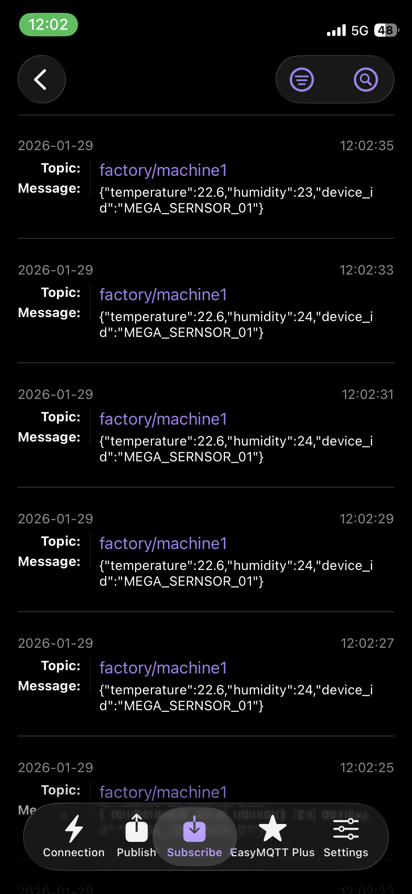
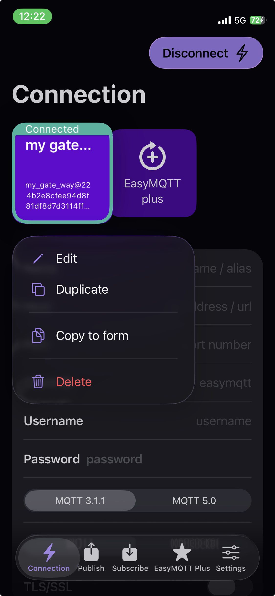
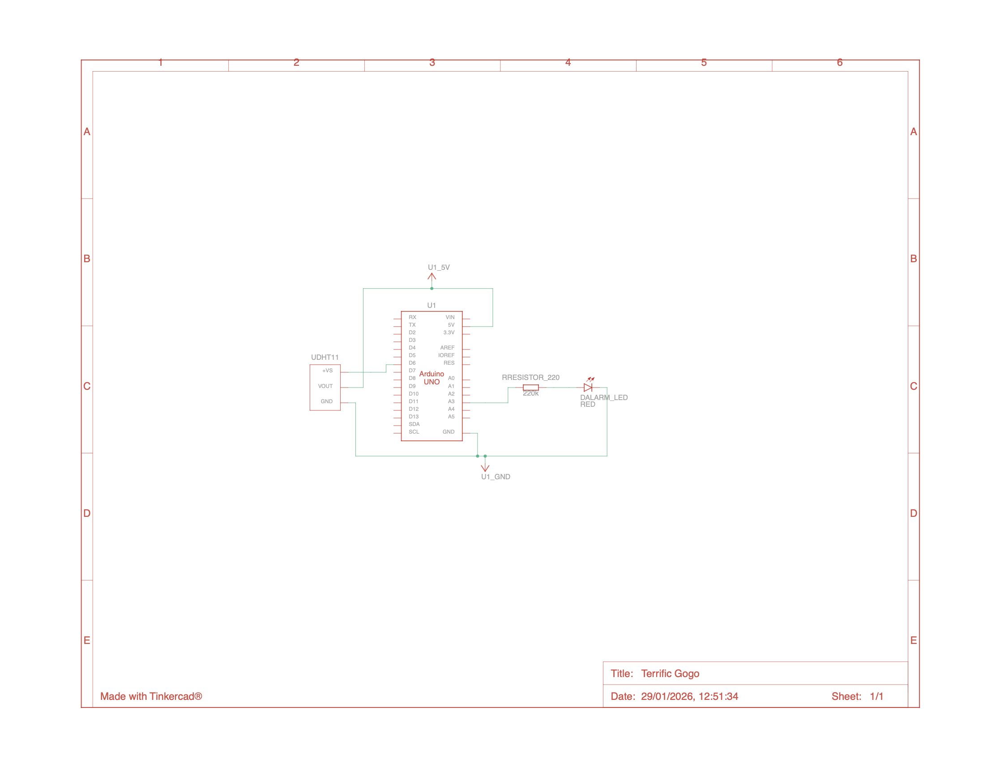

# Industrial IoT Gateway Prototype (Arduino + Raspberry Pi)

### 🚀 Project Overview
A mock industrial monitoring system that simulates the **Edge-to-Cloud** data pipeline used in modern engineering.

This project interfaces a low-level microcontroller (**Arduino**) acting as a sensor node with a linux-based Single Board Computer (**Raspberry Pi**) acting as an IoT Gateway. Data is processed at the edge and transmitted via **MQTT** telemetry.

**Real-time data visualization using standard MQTT Mobile Clients.**

| **Live Data Stream** | **Connection Status** |
|:---:|:---:|
|  |  |
| *Monitoring Temp/Humidity in real-time* | *Secure TLS Connection to HiveMQ* |

### 🏗 Architecture
**[Edge Device]** --> **[Python Gateway]** --> **[Cloud]** --> **[(Mobile) Client]**

1.  **Edge Node (Arduino Uno):**
    *   Reads Temperature/Humidity data (DHT11).
    *   Performs local logic (Red LED triggers if Temp > 25°C), simulating an alarm for overheating.
    *   Serializes data into JSON format.
2.  **Python Gateway (Raspberry Pi 4):**
    *   Listens to Serial/USB interface.
    *   Parses incoming JSON packets.
    *   Transmits data to the Cloud/Broker via MQTT.
3.  **Communication**
    *   Serial (USB): JSON encoded data.
    *   MQTT (WIFI): Secure TLS connection to HiveMQ Cloud.

### 🚀 Features:
*   **Real-time Data Parsing:** deserializes incoming JSON streams from serial ports.

*   **Fault Tolerance:** Handles serial disconnections and non-JSON data gracefully without crashing.

*   **Security:** Uses environment variables (.env) for credentials and TLS/SSL for cloud transport.

*   **Asynchronous Networking:** Uses Paho-MQTT background loops for non-blocking communication.

### 🛠 Tech Stack
*   **Hardware:** Arduino Uno, Raspberry Pi 4, DHT Sensor.
*   **Embedded:** C++ (Arduino Framework).
*   **Gateway:** Python 3, PySerial, Paho-MQTT.
*   **Protocols:** UART (Serial), MQTT, JSON.

### 🔌 Circuit Diagram
The circuit consists of a DHT11 temperature sensor and a status LED connected to the Arduino Uno.

| Arduino | Schematic |
| :--- | :--- |
|  | 

(designed with https://www.tinkercad.com/, *note: The standard temp. sensor is a placholder for the DHT11*)

**Wiring Pinout:**
| Component | Arduino Pin |
| :--- | :--- |
| **DHT11 Data** | Pin 6 |
| **Red LED** | Pin A3 |
| **VCC** | 5V |
| **GND** | GND |

### ⚙️ How to Run
**1. The Edge Node**
Flash the `arduino_edge/sensor_node.ino` to the Arduino Board.

**2. The Gateway**
Install dependencies on the Raspberry Pi:
`pip install -r pi_gateway/requirements.txt`

Run the gateway script:
`python3 pi_gateway/gateway.py`

### 🔮 Future Improvements
*   Add a local SQLite database on the Pi for offline data buffering.
*   Integrate Docker to containerize the Gateway script.